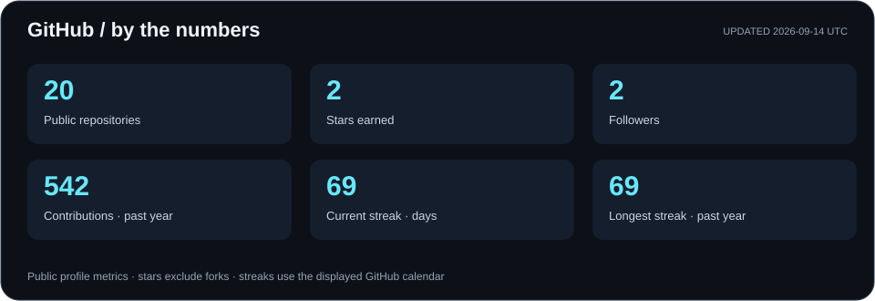
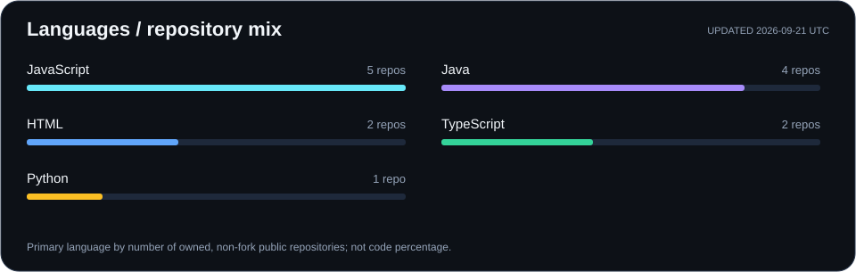
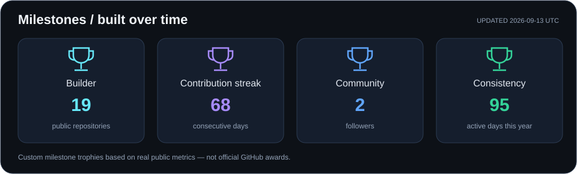

<div align="center">
  

 
<a href="https://git.io/typing-svg">
  
</a>

<br/><br/>


[](https://risikesh-portfolio.vercel.app/)
[](https://www.linkedin.com/in/risikesh-somnath-t-7b5222376)
[](https://github.com/Risikesh2006)

<br/>


</div>

<br/>

## 🧭 About Me

> *Software engineer focused on designing and shipping scalable, production-grade systems. I work across the stack — from interface to infrastructure — with a strong emphasis on clean architecture, performance, and reliability. Actively building AI-powered products and deepening my expertise in distributed systems and cloud-native engineering.*

- 🧠 **Software Engineering** — clean architecture, API design, testable systems
- 🤖 **AI / ML** — applied ML integration, LLM-powered features, intelligent automation
- 🌐 **Full Stack Development** — Next.js, TypeScript, Node.js, PostgreSQL
- 🎯 **Product Engineering Mindset** — building for real users, not just demos
- ☁️ **Currently deepening** — System Design, Cloud Computing, Distributed Systems

**🔭 Open To:** Software Engineering roles · AI/ML Engineering roles · Full-Stack opportunities · Open-source collaboration · Internships

---

## 🛠️ Tech Stack

<div align="center">

**Languages**
<br/>


**Frontend**
<br/>


**Backend & Databases**
<br/>


**Cloud, DevOps & Tooling**
<br/>


</div>

---

## 🤖 AI / ML Expertise

<div align="center">

| Domain | Proficiency | Details |
|---|:---:|---|
| LLM Integration | ⭐⭐⭐⭐ | Building AI-powered features (resume/idea generation) using LLM APIs |
| Applied Machine Learning | ⭐⭐⭐ | Model integration into production full-stack apps |
| Prompt Engineering | ⭐⭐⭐⭐ | Structured prompting for reliable, structured AI outputs |
| Data Pipelines | ⭐⭐⭐ | Processing & structuring data for AI-driven features |
| AI Product Design | ⭐⭐⭐⭐ | Designing AI-first user experiences end-to-end |

</div>

---

## 🚀 Featured Projects

<details open>
<summary><b>🎓 CampusConnect — Smart Campus Collaboration Platform</b></summary>
<br/>

A unified smart campus ecosystem enabling students to connect, collaborate, and create — combining social features, AI tooling, and opportunity discovery in one platform.

| Aspect | Detail |
|---|---|
| **Stack** | Next.js · TypeScript · PostgreSQL · Prisma · AI Integration |
| **Scale** | Multi-module platform: feed, messaging, admin, showcase |
| **Performance** | Server-side rendering, optimized query layer via Prisma |
| **Security** | Role-based access control, admin moderation layer |
| **Impact** | Centralizes campus collaboration, AI tools & opportunity discovery |
| **Repository** | [Smart_Campus](https://github.com/Risikesh2006/Smart_Campus) |

**Key Modules:**
- 🔗 Developer Feed — share ideas, posts, and updates with the campus community
- 💬 Real-time messaging between students and teams
- 🤖 AI-powered resume generator & project idea generator
- 🏆 Opportunities hub for hackathons, internships & events
- 🛡️ Admin dashboard for user management & content moderation
- 📁 Project showcase for publishing student work

[](https://github.com/Risikesh2006/Smart_Campus)

</details>

## 💻 Coding Profiles

<div align="center">

[](https://leetcode.com/u/RisikeshSomnathT/)
[](https://www.geeksforgeeks.org/profile/risisonh77d?tab=overview)
[](https://www.hackerrank.com/profile/risisonu2006)

</div>

---

## 📊 GitHub Analytics

<div align="center">




</div>

---

## 🏅 GitHub Trophies

<div align="center">



</div>

<sub>Personal milestone trophies calculated from public GitHub data, not official GitHub awards.</sub>

---

## 📈 Contribution Activity

<div align="center">

<a href="https://github.com/Risikesh2006?tab=overview">
  
</a>

</div>

<sub>Graphics refresh daily. Each card shows its latest update date.</sub>

---

## 🐍 Contribution Snake

<div align="center">

<picture>
  <source media="(prefers-color-scheme: dark)" srcset="https://raw.githubusercontent.com/Risikesh2006/Risikesh2006/output/github-contribution-grid-snake-dark.svg?palette=green-v2" />
  <source media="(prefers-color-scheme: light)" srcset="https://raw.githubusercontent.com/Risikesh2006/Risikesh2006/output/github-contribution-grid-snake.svg" />
  
</picture>

</div>

---

## 🎯 Current Focus

```yaml
Learning:
  - System Design & Distributed Architecture
  - Cloud-Native Engineering (AWS)
  - Advanced AI/LLM Integration Patterns

Building:
  - CampusConnect (Smart Campus Collaboration Platform)
  - AI-powered developer tools

Exploring:
  - Kubernetes & Container Orchestration
  - Retrieval-Augmented Generation (RAG) systems

Open_To:
  - Software Engineering Roles
  - AI/ML Engineering Roles
  - Open Source Collaboration
```

---

## 🤝 Connect

<div align="center">

[](https://www.linkedin.com/in/risikesh-somnath-t-7b5222376)
[](https://github.com/Risikesh2006)
[](https://risikesh-portfolio.vercel.app/)

</div>

---

<div align="center">

*"Good code is written for the next engineer who reads it — including future me."*


</div>
